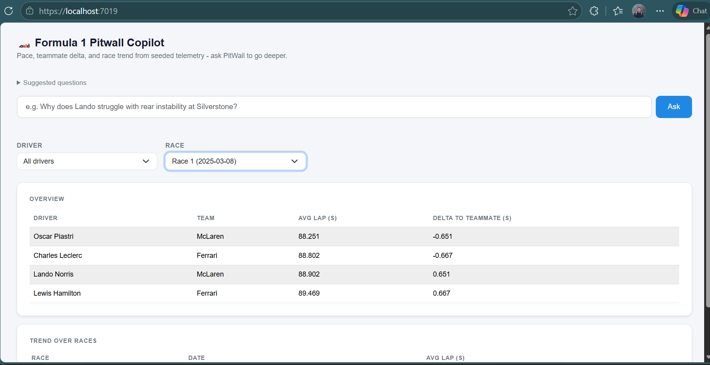
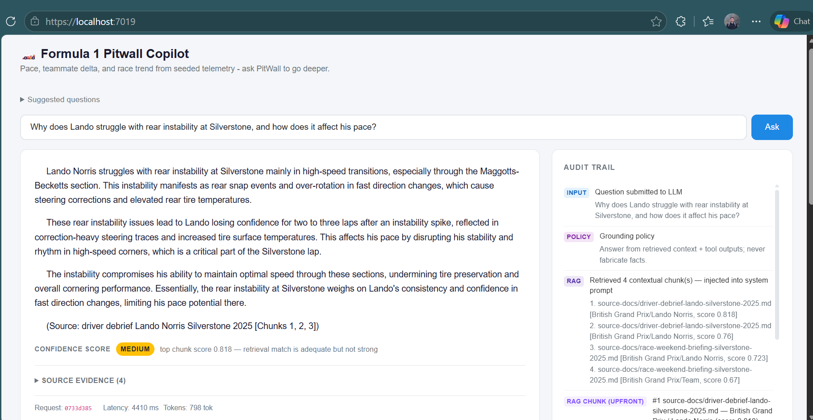

# 🏎️ PitWall Copilot

> AI-native F1 strategy copilot with tool orchestration, RAG grounding, and transparent reasoning.

PitWall Copilot is a portfolio-focused full-stack Azure/.NET AI project that simulates an internal race engineering assistant for a Formula 1 team.

Users ask natural-language strategy questions, and the system responds with grounded analysis by combining:

- deterministic telemetry tools (driver pace, teammate delta, consistency)
- retrieval using RAG (using Azure AI Search) from race briefings and driver debriefs
- explicit decision tracing and audit trails with confidence scoring

This isn't just "chatbot answers" but an **observable AI behavior** you can inspect end-to-end.

## Screenshots

| Landing + Dashboard | Ask Result + Audit Trail |
| --- | --- |
|  |  |

## Why I built this

I wanted to build a learning project that demonstrates practical AI engineering patterns in a way that's easy to inspect and explain.

- **AI orchestration, not a single prompt**: retrieval + function/tool calling + fallback policy
- **Transparent output**: visible audit trail shows how the answer was produced
- **Production-minded behavior**: graceful degradation when keys/services are missing
- **Grounded by design**: answers are tied to retrieved context and explicit tool outputs

## What it does

PitWall Copilot answers questions like:

- "At Silverstone 2025, what were the top performance risks and setup priorities?"
- "Why did Lando lose consistency after instability spikes?"
- "How should we think about soft vs medium tire behavior over a stint?"

Each response includes:

- final answer
- why-summary
- confidence level and confidence reasons
- full audit trail (input -> policy -> retrieval -> tool decisions -> result)
- tool usage and token metrics

## Architecture

This project follows a **Clean Architecture** style with clear layer boundaries:

- `Domain`: core entities and business model
- `Application`: use cases, contracts, DTOs, confidence evaluation logic
- `Infrastructure`: external integrations (OpenAI/Azure Search), EF Core persistence, tool implementations
- `Web`: Blazor UI and app composition

Dependency direction is inward (`Web` -> `Infrastructure` -> `Application` -> `Domain`), and orchestration logic depends on application contracts rather than UI concerns.

## How it works

```text
User Question
  -> Embed query
  -> Retrieve context from Azure AI Search
  -> LLM policy decides which tools to call
  -> Tool results + retrieved context fed into final response
  -> Confidence + audit trail returned to UI
```

### Core tools

- `SearchRagContext` - semantic retrieval over race briefings/debriefs
- `FindDriversByName` - fuzzy name resolution
- `GetDriverPerformance` - single-driver telemetry summary
- `CompareDrivers` - side-by-side comparisons

## RAG Pipeline (Azure AI Search + Embeddings)

The retrieval path is vector-based and grounded in seeded race knowledge.

1. **Chunk source documents**  
   Race briefings and driver debriefs are chunked and stored in `sample-data/rag/chunks.ndjson` with metadata (season, race, circuit, driver, doc type, source path).

2. **Create embeddings**  
   The app generates embeddings using the configured embedding model (`OPENAI_EMBEDDING_MODEL`, e.g. `text-embedding-3-small`).

3. **Index in Azure AI Search**  
   On startup, `AzureSearchRagService` ensures the index exists and uploads chunk text + vectors to fields such as:
   - `content`
   - `contentVector`
   - metadata fields (`race`, `driver`, `circuit`, `docType`, `source`, etc.)

4. **Query-time retrieval**  
   For each question, the query is embedded and used in a vector search (`SearchRagContext`) against `contentVector` to fetch top-k relevant chunks.

5. **Grounded answer generation**  
   Retrieved chunks are injected into the model context, combined with tool outputs, and then the final answer is generated with:
   - audit trail entries (retrieval + tool decisions/results)
   - confidence score/rationale
   - source evidence shown in UI

This makes the system traceable: you can see exactly what was retrieved, what tools were called, and why the answer is trustworthy (or not).

### Fallback behavior

If AI config is missing or invalid, the app falls back safely:

- deterministic stats still work for supported question types
- strategy-style questions return an explicit "AI path required" response
- startup logs report missing/placeholder config keys

## Tech stack

| Layer | Technology |
| --- | --- |
| Frontend | Blazor Server (.NET 10) |
| Backend | ASP.NET Core, EF Core, SQLite |
| AI | OpenAI client integration (`OpenAI.Chat`) |
| Retrieval | Azure AI Search (vector search) |
| Architecture | Clean Architecture + vertical slices |

## Run locally

### Prerequisites

- .NET SDK 10
- OpenAI-compatible API key/model access
- Azure AI Search service (for RAG)
- optional: `dotnet dev-certs https --trust`

### Setup

```powershell
# Edit src/Web/.env with your keys
cd src/Web
dotnet run --launch-profile https
```

Open `https://localhost:7019`.

### Environment variables

```bash
OPENAI_API_KEY=...
OPENAI_ENDPOINT=https://YOUR-RESOURCE.openai.azure.com
OPENAI_MODEL=gpt-4o-mini
OPENAI_EMBEDDING_MODEL=text-embedding-3-small

AZURE_SEARCH_ENDPOINT=https://YOUR-SERVICE.search.windows.net
AZURE_SEARCH_API_KEY=...
AZURE_SEARCH_INDEX_NAME=pitwall-rag-index
```

On startup the app seeds SQLite data and attempts to initialize/index the RAG store.

## Roadmap

- evaluation harness with golden prompts
- hybrid retrieval (semantic + keyword)
- richer token/cost reporting in UI
- prompt/model version tracking
- Azure deployment with Key Vault + app telemetry
