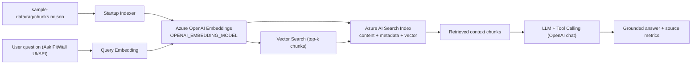

# Architecture Notes

## RAG Flow (Simple)

## What Happens

- At startup, the app indexes chunked F1 notes by generating embeddings and storing vectors + metadata in Azure AI Search.
- For each question, the app retrieves top matching chunks, injects that context into Ask PitWall, and returns a grounded response with source traces.
